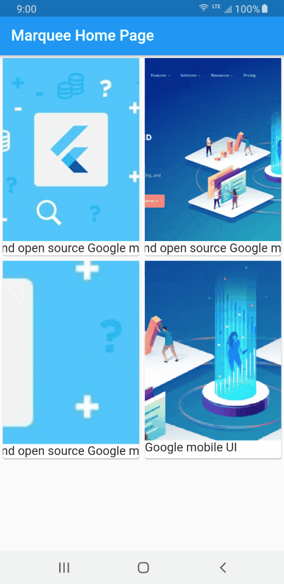

# marquee_widget

A Flutter widget that scrolls Widget Text and other Widget with supported RTL.
Provides many customizationsincluding custom scroll directions and velocities, 
pausing after every round and specifying custom durations and curves for
accelerating and decelerating.


- [Pub Package](https://pub.dartlang.org/packages/marquee_widget)
- [GitHub Repository](https://github.com/yousifk/marquee_widget)

## Usage





This is a minimalistic example:

```dart
Marquee(
  child:Text( 'This project is a starting point for a Dart package, a library module containing code that can be shared easily across multiple Flutter or Dart projects. '),
)
```

And here's a piece of code that makes full use of the marquee's
customizability:

set Width and Height 
with Continer()

```dart
Marquee(
  child:Text( 'This project is a starting point for a Dart package'),
  scrollAxis: Axis.horizontal,
  textDirection : TextDirection.rtl,
  animationDuration: Duration(seconds: 1),
  backDuration: Duration(milliseconds: 5000),
  pauseDuration: Duration(milliseconds: 2500),
)
```


Exmpale


```dart
GridView.count(
        crossAxisCount: 2,
        childAspectRatio: 0.7,
        children: <Widget>[
          GridTile(
            child: Card(
              child: Column(
                children: <Widget>[
                  Expanded(
                      child: Image.network(
                    "https://i.pinimg.com/564x/9d/a6/36/9da636b9e60ea40b18921b0053b7d486.jpg",
                    fit: BoxFit.fitHeight,
                  )),
                  Marquee(
                      child: Text(
                    "Flutter is a free and open source Google mobile UI ",
                    style: TextStyle(fontSize: 16),
                  )),
                ],
              ),
            ),
          ),
          GridTile(
            child: Card(
              child: Column(
                children: <Widget>[
                  Expanded(
                      child: Image.network(
                    "https://cdn-images-1.medium.com/max/1000/1*upTyVPOfBb0c4o1r57C9_w.png",
                    fit: BoxFit.fitHeight,
                  )),
                  Marquee(
                      child: Text(
                    "Flutter is a free and open source Google mobile UI ",
                    style: TextStyle(fontSize: 16),
                  )),
                ],
              ),
            ),
          ),
          GridTile(
            child: Card(
              child: Column(
                children: <Widget>[
                  Expanded(
                      child: Marquee(
                          child: Container(
                              width: 1000,
                              child: Image.network(
                                "https://i.pinimg.com/564x/9d/a6/36/9da636b9e60ea40b18921b0053b7d486.jpg",
                                fit: BoxFit.fitWidth,
                              )))),
                  Marquee(
                      child: Text(
                    "Flutter is a free and open source Google mobile UI ",
                    style: TextStyle(fontSize: 16),
                  )),
                ],
              ),
            ),
          ),
          GridTile(
            child: Card(
              child: Column(
                children: <Widget>[
                  Marquee(
                      child: Container(width: 1000,
                        child: Column(
                    children: <Widget>[
                        Marquee(
                            child: Container(
                                width: 1000,height: 260,
                                child: Image.network(
                                  "https://cdn-images-1.medium.com/max/1000/1*upTyVPOfBb0c4o1r57C9_w.png",
                                  fit: BoxFit.fitWidth,
                                ))),
                        Text(
                          "Flutter is a free and open source Google mobile UI ",
                          style: TextStyle(fontSize: 16),
                        ),
                    ],
                  ),
                      )),
                ],
              ),
            ),
          ),
        ],
      ),
```


For more information about the properties, have a look at the
[API reference](https://pub.dartlang.org/documentation/marquee/).

## LICENSE

```
Copyright (c) 2018 Marcel Garus

Permission is hereby granted, free of charge, to any person obtaining a copy
of this software and associated documentation files (the "Software"), to deal
in the Software without restriction, including without limitation the rights
to use, copy, modify, merge, publish, distribute, sublicense, and/or sell
copies of the Software, and to permit persons to whom the Software is
furnished to do so, subject to the following conditions:

The above copyright notice and this permission notice shall be included in all
copies or substantial portions of the Software.

THE SOFTWARE IS PROVIDED "AS IS", WITHOUT WARRANTY OF ANY KIND, EXPRESS OR
IMPLIED, INCLUDING BUT NOT LIMITED TO THE WARRANTIES OF MERCHANTABILITY,
FITNESS FOR A PARTICULAR PURPOSE AND NONINFRINGEMENT. IN NO EVENT SHALL THE
AUTHORS OR COPYRIGHT HOLDERS BE LIABLE FOR ANY CLAIM, DAMAGES OR OTHER
LIABILITY, WHETHER IN AN ACTION OF CONTRACT, TORT OR OTHERWISE, ARISING FROM,
OUT OF OR IN CONNECTION WITH THE SOFTWARE OR THE USE OR OTHER DEALINGS IN THE
SOFTWARE.
```
